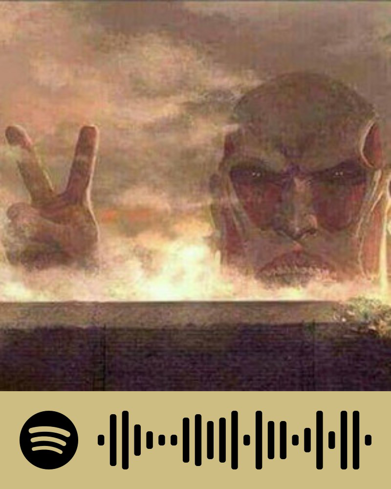

  

<h1 align="center"><em><strong>心臓を捧げよ！</strong></em></h1>

  <em>Shinzou wo Sasageyo!</em> 
  <strong>Dedicate your hearts!</strong>

---

<h2 align="center">🌸 Welcome to My Otaku Coder Realm! 🌸</h2>

  <strong>Code Ninja 🥷 | Anime Sage 🧙‍♂️ | Open Source Hero 🦸‍♂️</strong>

  
  
  <!-- 
  
   
   -->

---

<!-- ### 🎭 My Backstory

Konnichiwa, fellow otakus and code enthusiasts! I'm Ha Nguyen, a passionate developer on a quest to merge the worlds of anime and technology. When I'm not channeling my inner Levi to clean up code, you can find me exploring digital realms or binging the latest seasonal anime.

### 💻 Jutsu Arsenal

  
  
  
  
  
  
  
  
  
  
  
  
  
  

### 🌟 Legendary Quests

- [Anime Recommender](https://github.com/your-username/anime-recommender) - An AI-powered anime recommendation system.
- [Manga Translator](https://github.com/your-username/manga-translator) - Automagically translate manga pages with OCR and ML.
- [Waifu Generator](https://github.com/your-username/waifu-generator) - Create your perfect waifu using GAN technology.

### 📈 Battle Stats

  

### 🎯 Season 2025 Goals

- [ ] Contribute to anime-related open-source projects
- [ ] Master the art of WebGL for epic anime-style web experiences
- [ ] Launch an anime-inspired tech blog
- [ ] Cosplay at a major tech conference

--- -->

  <em>"I don't want to conquer anything. I just think the guy with the most freedom in this whole ocean... is the Pirate King!" - Monkey D. Luffy</em>

  <strong>
  Thanks for visiting my profile! May your code be bug-free and your watchlist ever-growing! 🍜
  </strong>

